## go语言实现简易区块链项目

#### ！！！！注意：此项目网络部分功能好像有bug，没有解决，其它部分功能正常，在readme文档最底部有说明，应该参考原始项目可以解决，这里没有时间就没解决，请注意，这不是一个完整demo

### 学习项目
#### 项目代码参考：https://github.com/Jeiwan/blockchain_go
#### 视频教程：
go语言七步铸自己的比特币：https://www.bilibili.com/video/BV1U4411K7LK
go语言与区块链视频：https://www.bilibili.com/video/BV1H5411L7tt

(注：两个视频教程内容大致相似，只不过某些地方可能内容不全，其实视频内容中的代码也主要参考的是 Jeiwan/blockchain_go 仓库，视频中的少许代码可能有误，可以参考 Jeiwan/blockchain_go 的源代码进行修改，视频可以作为理解项目的思路参考)

读懂比特币白皮书，区块链开山之作，中本聪到底说了什么？| 李查说：https://www.bilibili.com/video/BV1Hh411Z7id
(up主对白皮书的讲解个人认为比较好，起码我可以听懂还能从中有所收获😂)

建议 star Jeiwan/blockchain_go 仓库，给视频up主点赞投币，以示支持。只是一个建议，不必太在意哈😆

### 项目简要说明

为保持项目环境干净，在项目目录中执行 “go build ./” 命令前，请删除 blockchain.db、blockchain.exe、wallet.dat 文件，重新 build 生成 blockchain.exe，以避免运行程序时受历史数据影响，导致出现数据不一致的情况

代码注释有些部分表述不清，以实际代码实现为准

区块链持久化使用bolt数据库(键值数据库)，区块哈希作为键，区块内容为值，链中最新区块的哈希键值为“1”

实现交易类Transaction

### 项目编译运行测试
Jeiwan/blockchain_go 仓库的运行说明，中文版，下面的运行过程也主要参考的是 上面提及的视频教程 与 此中文教程 ：https://github.com/liuchengxu/blockchain-tutorial/blob/master/content/part-7/network.md
1、编译生成可执行程序：
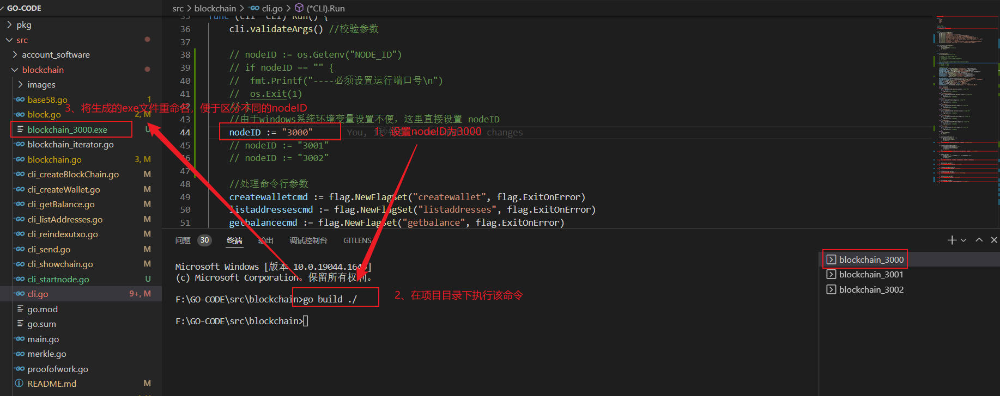
重复上述操作，分别生成 blockchain_3000.exe、blockchain_3001.exe、blockchain_3002.exe 三个代表不同节点的可执行程序。
(注：如果没有改动项目的话，go build ./ 命令生成的可执行程序原名应该为 blockchain.exe，结合 go build 时设置的nodeID值，对可执行程序进行重命名，以便于区分不同可执行程序对应的nodeID值)
最终生成的可执行程序：
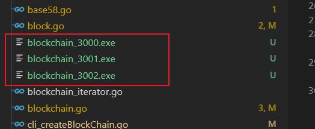
2、主要命令说明：
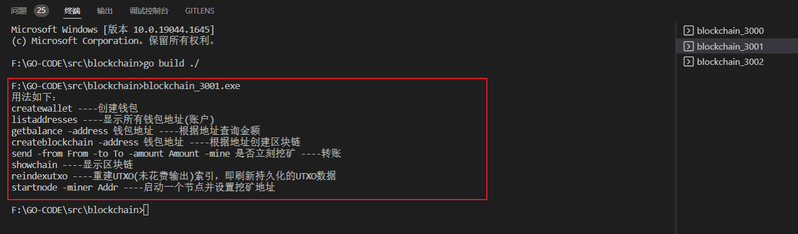
3、node 3000 创建一个钱包并依据钱包地址挖矿生成创世块，从而创建区块链：
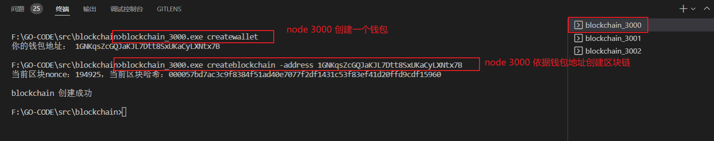
4、复制步骤3中生成的blockchain_3000.db，将副本重命名为blockchain_base.db，便于在其它node中使用， .db 文件里面是区块信息：
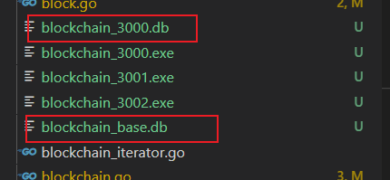
5、node 3001 创建若干钱包，以便后期测试：
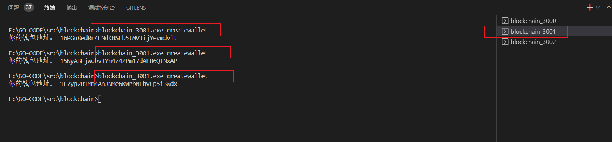
6、node 3000 向 node 3001 创建的钱包地址转账：
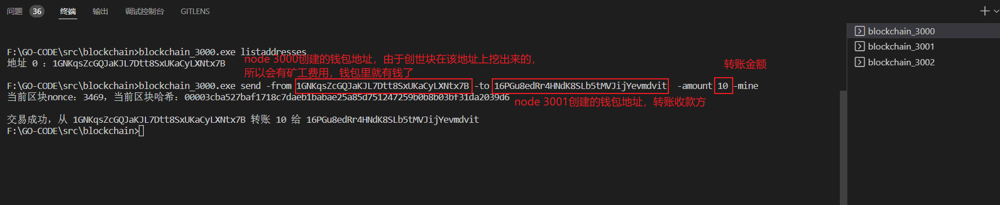
-mine 标志指的是块会立刻被同一节点挖出来。必须要有这个标志，因为初始状态时，网络中没有矿工节点。
7、node 3000 启动节点：
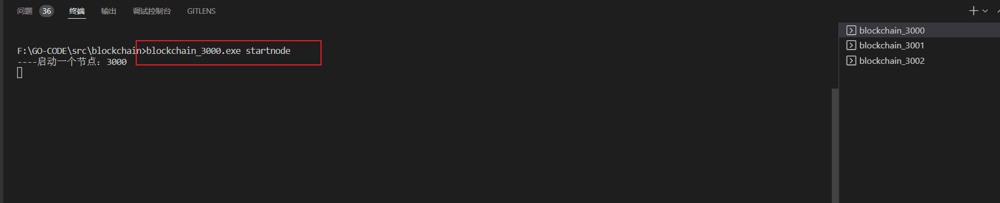
(注：原项目实现的比特币系统主要演示的是其思想，由于理想的比特币系统应该是完全的去中心化P2P网络，但是实现起来比较复杂，因此作者实现的是部分中心化的比特币系统，这里的node 3000就是充当中心节点，由于演示网络功能和数据同步的)
8、node 3001 保存创世块节点的区块链数据，并运行节点：
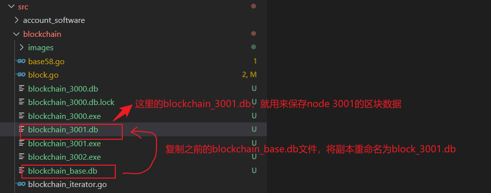
启动node 3001，node 3001会从node 3000上同步数据
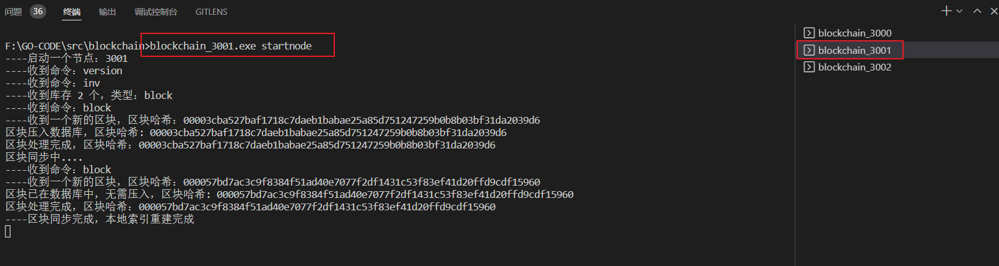
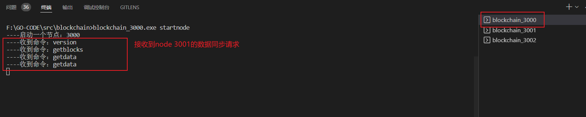
9、node 3001暂停节点，检查钱包余额：
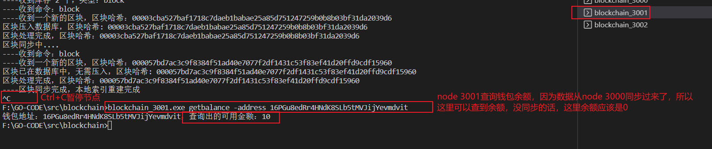
10、同步骤8第一张图操作，为node 3002创建 .db文件保存区块数据：
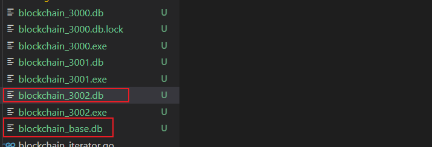
11、node_3002创建一个钱包并启动node_3002作为一个矿工节点：
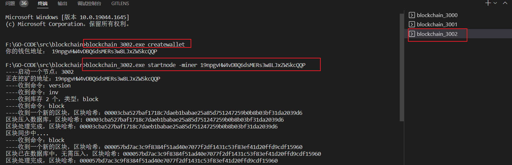
12、矿工节点代码有点问题，在其它节点创建的新交易无法将数据同步到矿工节点挖矿生成区块，没有时间仔细调bug了......
原项目未实现出来的功能，其实也是最后一部分了：
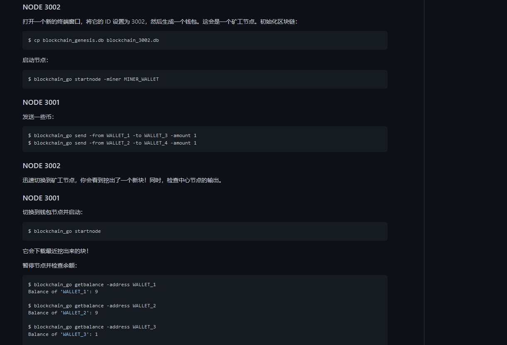
